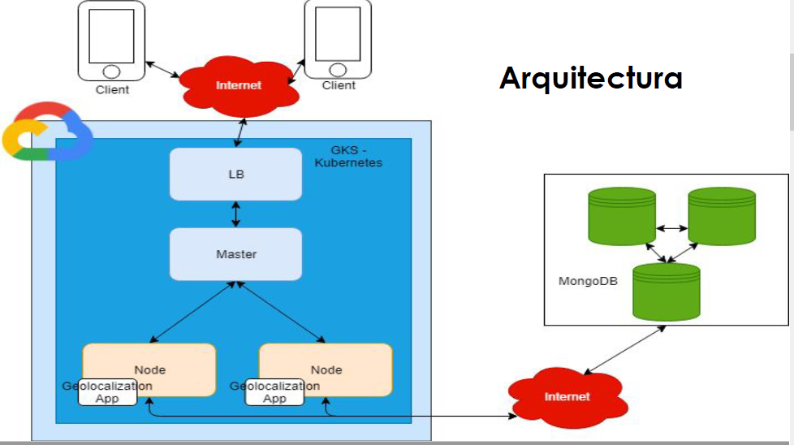
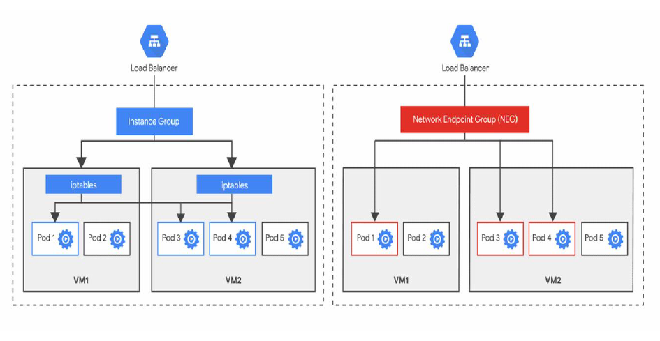

# Proyecto 4 - Aplicación de Geolocalización
## By: Anderson Grajales - agrajal7@eafit.edu.co
##     Hamilton Tobón - htobonm@eafit.edu.co
##     Julian Sánchez - jsanch89@eafit.edu.co
## 2019-1
## Descripción
Ésta aplicación permite a sus usuarios llevar un registro de todos aquellos lugares que han visitado. Además, el usuario tiene la posibilidad de visualizarlos en un mapa que es cargado una vez el usuario está registrado.

# 1. Análisis y Diseño

## 1.1 Requisitos Funcionales
  * La aplicación debe permitir el incio de sesión de un usuario previamente registrado.
  * La aplicación debe permitir a las personas crear una cuenta teniendo su nombre, e-mail y contraseña.  
  * La aplicación debe permitir a sus usuarios registrar las ubicaciones que quieran recordar.
  * La aplicación debe mostrar a sus usuarios todas los lugares que han escogido como sus favoritos.

## 1.2 Requisitos No Funcionales
  * La aplicación no debe permitir a un usuario acceder al perfil de otro usuario.
  * La aplicación no debe permitir a un usuario revisar las rutas si no se ha entrado en el sistema previamente.
  * La aplicación debe estar disponible todo el tiempo para un usuario.
  * La aplicación debe admitir almenos x usuarios activos.
  * En el momento de cerrar sesión la aplicación no debe permitir a un usuario ingresar nuevamente ha su perfil, a menos de que vuelva a iniciar sesión.

## 1.3 Modelo de Datos

### 1.3.1 Un usuario dentro de la aplicación está identificado con los siguientes atributos:
```
  User: {
    fullName: {
      type: String,
      required: true
    },
    email: {
      type: String,
      required: true
    }
    hashPassword: {
      type: String,
      required: true
    }
  }
```
### 1.3.1 Una ubicación dentro de la aplicación está identifacada con los siguientes atributos:
```
  Location: {
    logitude: {
      type: Number,
      required: true
    },
    latitude: {
      type: Number,
      required: true
    },
    user: {
      type: String,
      required: true,
      default_value: (Current logged in user)
    },
    date: {
      type: String,
      required: true,
      default_value: (Current Date with Current Hour)
    }
  }
```
# 2. Tecnología Usada
- Servidor de aplicación [Node JS](https://nodejs.org/es/), [Express JS Framework](https://expressjs.com/es/).
- Servidor Web [Nginx](https://www.nginx.com/).
- Framework de Diseño [Bootstrap 4](https://getbootstrap.com/).
- Base de Datos [Mongo DB](https://www.mongodb.com/es).
- Contenedor [Docker](https://www.docker.com/).
# 3. Arquitectura

## Diseño


## Google Cloud



# 4. Desplegar en el DCA y en AWS

## Instalación

Primero, instalar `git` (En caso de que aún no lo tenga instalado):

```sh
user1$ sudo yum install git
```


Clonar este repositorio en el `home` de su máquina:

```
user1$ cd ~
user1$ git clone https://github.com/angrajales/sample_geolocalization_app.git
```

Instalar e inicializar `docker` en su máquina(En caso de que aún no lo tenga instalado):
```
source: https://docs.docker.com/install/linux/docker-ce/centos/

user1$ sudo yum-config-manager --add-repo https://download.docker.com/linux/centos/docker-ce.repo
user1$ sudo yum install docker-ce
user1$ sudo systemctl start docker
user1$ sudo systemctl enable docker

instalar docker-compose: https://docs.docker.com/compose/install/

user1$ sudo curl -L https://github.com/docker/compose/releases/download/1.20.1/docker-compose-`uname -s`-`uname -m` -o /usr/local/bin/docker-compose
user1$ sudo chmod +x /usr/local/bin/docker-compose

```
## Crear un certificado `ssl`:

Entrar a la carpeta del proyecto `sample_geolocalization_app`:

```sh
user1$ cd sample_geolocalization_app
```

Luego, crear el certificado `ssl`:

```sh
user1$ sudo openssl req -x509 -nodes -days 365 -newkey rsa:2048 -keyout ssl/nginx.key -out ssl/nginx.crt
```
## Desplegar

Crear el contenedor de `docker`:

```
user1$ docker-compose build
```

Finalmente, ejecutar el contenedor de `docker`:

```
user1$ docker-compose up
```

O si quieres que se ejecute en modo `detach`:

```
user1$ docker-compose up -d
```


